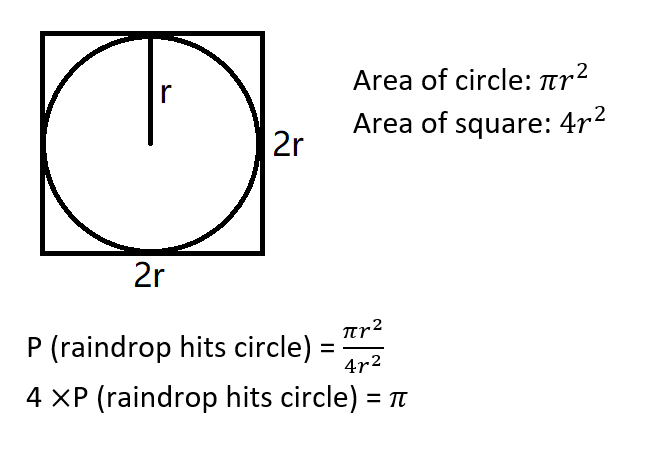
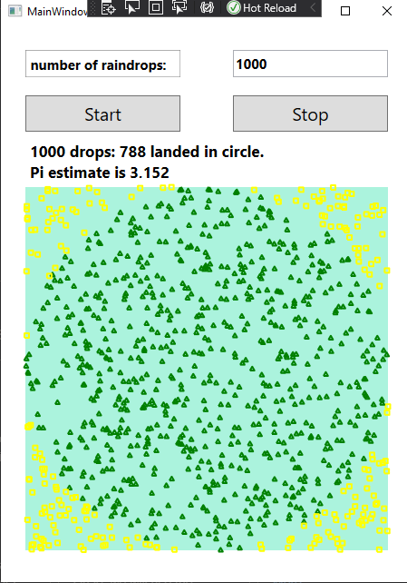
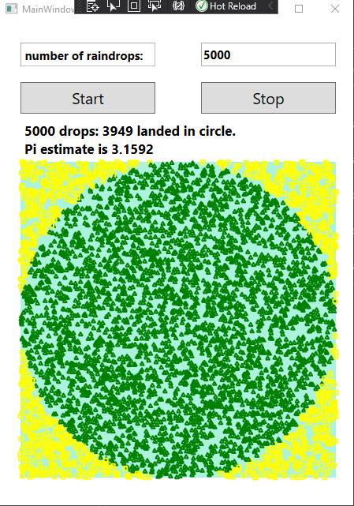
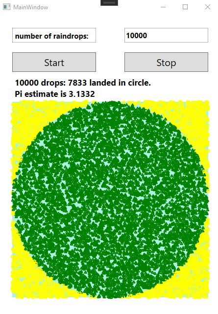
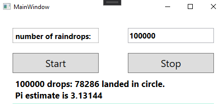
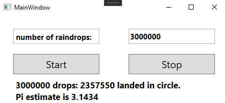
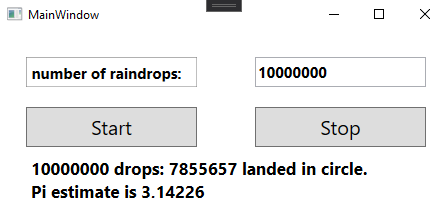

# estimating-pi-csharp

Estimating Pi using Monte Carlo Simulation.

An estimate of pi is obtained by dividing the
number of raindrops that hit the circle and the square
and multiplying the result by 4.

## Results
Using 1000 drops:

Using 5 000 drops:

Using 10 000 drops:

Using 100 000 drops:

Using 3 000 000 drops:

Using 10 000 000 drops:

### Notes
The program starts to slow down when using raindrops greater than 10000
due to the plotting of raindrops on the square. Therefore, I commented out the
plotting feature and only focused on getting the results for raindrop
values greater than 10000.

I will look for ways to optimize the program in the future.
